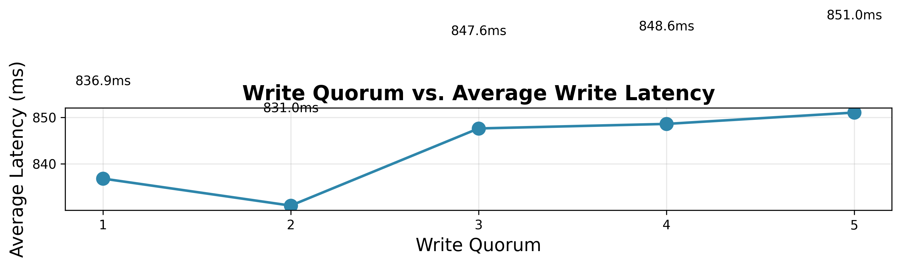

# Distributed Key-Value Store with Single-Leader Replication

A distributed key-value store implementation in Python with single-leader replication, semi-synchronous writes, and configurable write quorum. The system demonstrates the trade-offs between consistency and availability in distributed systems.

## Overview

This project implements a distributed key-value store with the following characteristics:

- **Single-Leader Replication**: Only the leader accepts write operations
- **1 Leader + 5 Followers**: Run in separate Docker containers
- **Semi-Synchronous Replication**: Configurable write quorum for durability guarantees
- **Concurrent Request Processing**: Both leader and followers handle requests concurrently using asyncio
- **Network Simulation**: Configurable network delay simulation [MIN_DELAY, MAX_DELAY]
- **REST API**: JSON-based HTTP communication

## Architecture

```
                                    Client
                                       |
                                       | POST /set
                                       v
                            +----------+----------+
                            |      Leader         |
                            |   (Port 8080)       |
                            +----------+----------+
                                       |
                    +------------------+------------------+
                    |         |         |         |        |
              (replicate)  (replicate) ...              (replicate)
                    |         |         |         |        |
                    v         v         v         v        v
            +--------+  +--------+  +--------+  +--------+  +--------+
            |Follower|  |Follower|  |Follower|  |Follower|  |Follower|
            |  8081  |  |  8082  |  |  8083  |  |  8084  |  |  8085  |
            +--------+  +--------+  +--------+  +--------+  +--------+
```

### Key Design Decisions

1. **Single-Leader Pattern**: Simplifies consistency by having a single source of truth for writes
2. **Semi-Synchronous Replication**: Leader waits for N followers to confirm before responding to client
3. **Concurrent Replication**: Requests sent to followers in parallel using asyncio
4. **Network Delay Simulation**: Each follower receives requests with random delays to simulate real-world conditions

## Features

### ✅ Single-Leader Replication
- Only leader accepts writes (POST, DELETE)
- All nodes accept reads (GET)
- Automatic replication to all followers

### ✅ Semi-Synchronous Replication
- Configurable write quorum (WRITE_QUORUM env variable)
- Leader waits for N confirmations before reporting success
- Provides stronger consistency guarantees than async replication

### ✅ Concurrent Processing
- All HTTP requests handled concurrently using `aiohttp`
- Leader sends replication requests in parallel
- Thread-safe key-value store with asyncio locks

### ✅ Network Simulation
- Configurable delay range [MIN_DELAY, MAX_DELAY]
- Each replication request gets random delay
- Simulates real-world network latency

### ✅ Docker Deployment
- 6 containers (1 leader + 5 followers)
- Configuration via environment variables
- Docker Compose for orchestration

## Implementation Details

### Project Structure

```
.
├── server.py              # Main server implementation
├── Dockerfile             # Container image definition
├── docker-compose.yml     # Orchestration configuration
├── requirements.txt       # Python dependencies
├── test.py               # Integration test
└── README.md             # This file
```

### Core Components

#### 1. KeyValueStore Class
Thread-safe in-memory storage with asyncio locks:

```python
class KeyValueStore:
    """Thread-safe key-value store with concurrent access support."""
    
    def __init__(self):
        self.store: Dict[str, str] = {}
        self.lock = asyncio.Lock()
    
    async def get(self, key: str) -> str:
        async with self.lock:
            return self.store.get(key)
    
    async def set(self, key: str, value: str) -> None:
        async with self.lock:
            self.store[key] = value
```

#### 2. ReplicationManager Class
Handles concurrent replication with network delay simulation:

```python
class ReplicationManager:
    """Manages replication from leader to followers."""
    
    async def replicate_to_follower(self, follower_url: str, operation: Dict) -> bool:
        # Simulate network lag with random delay
        if self.max_delay > 0:
            delay = random.uniform(self.min_delay, self.max_delay)
            await asyncio.sleep(delay)
        
        # Send replication request
        async with self.session.post(f"{follower_url}/replicate", json=operation) as response:
            return response.status == 200
    
    async def replicate(self, operation: Dict) -> int:
        # Replicate to all followers concurrently
        tasks = [self.replicate_to_follower(url, operation) for url in self.follower_urls]
        results = await asyncio.gather(*tasks, return_exceptions=True)
        return sum(1 for r in results if r is True)
```

#### 3. Semi-Synchronous Write Handler

```python
async def handle_set(self, request):
    """Handle SET request with semi-synchronous replication."""
    data = await request.json()
    key = data.get('key')
    value = data.get('value')
    
    # 1. Write to leader's local store
    await self.store.set(key, value)
    
    # 2. Replicate to followers and wait for confirmations
    replicated_count = await self.replication_manager.replicate({
        "operation": "set",
        "key": key,
        "value": value
    })
    
    # 3. Check if write quorum is met
    if replicated_count < self.write_quorum:
        return web.json_response({
            "error": "Write quorum not met",
            "replicated": replicated_count,
            "required": self.write_quorum
        }, status=500)
    
    # 4. Success - quorum met
    return web.json_response({
        "success": True,
        "key": key,
        "value": value,
        "replicated": replicated_count
    })
```

## Setup and Running

### Prerequisites
- Docker and Docker Compose
- Python 3.11+ (for running tests)

### 1. Start the Cluster

```bash
# Build and start all containers
docker-compose up --build -d

# Check container status
docker-compose ps

# View logs
docker logs kv-leader
docker logs kv-follower1
```

### 2. Configuration

All configuration is done through environment variables in `docker-compose.yml`:

```yaml
leader:
  environment:
    - IS_LEADER=true
    - PORT=8080
    - FOLLOWER_URLS=http://follower1:8080,http://follower2:8080,...
    - WRITE_QUORUM=3        # Require 3/5 followers to confirm
    - MIN_DELAY=0           # Min network delay in milliseconds
    - MAX_DELAY=1000        # Max network delay in milliseconds
```

**Key Configuration Parameters:**

| Variable | Description | Default |
|----------|-------------|---------|
| `IS_LEADER` | Whether node is leader | `false` |
| `WRITE_QUORUM` | Number of followers required for success | `0` |
| `MIN_DELAY` | Minimum replication delay (ms) | `0` |
| `MAX_DELAY` | Maximum replication delay (ms) | `0` |
| `FOLLOWER_URLS` | Comma-separated list of follower URLs | - |

### 3. Stop the Cluster

```bash
docker-compose down
```

## API Documentation

### Endpoints

| Method | Path | Used By | Description |
|--------|------|---------|-------------|
| GET | `/health` | All clients | Health check and role info |
| GET | `/get/{key}` | All clients | Read value for a key |
| POST | `/set` | Clients → Leader | Write key-value pair |
| DELETE | `/delete/{key}` | Clients → Leader | Delete a key |
| GET | `/all` | All clients | Get all key-value pairs |
| POST | `/replicate` | Leader → Followers | Internal replication |

### Example API Calls

#### 1. Health Check

```bash
curl http://localhost:8080/health
```

**Response:**
```json
{
  "status": "healthy",
  "role": "leader",
  "timestamp": "2025-11-30T12:34:56.789012"
}
```

#### 2. Write Value (Leader Only)

```bash
curl -X POST http://localhost:8080/set \
  -H "Content-Type: application/json" \
  -d '{"key": "username", "value": "alice"}'
```

**Success Response:**
```json
{
  "success": true,
  "key": "username",
  "value": "alice",
  "replicated": 5
}
```

**Quorum Failure Response (HTTP 500):**
```json
{
  "error": "Write quorum not met",
  "replicated": 2,
  "required": 3
}
```

#### 3. Read Value (Any Node)

```bash
# Read from leader
curl http://localhost:8080/get/username

# Read from follower
curl http://localhost:8081/get/username
```

**Response:**
```json
{
  "key": "username",
  "value": "alice"
}
```

#### 4. Get All Data

```bash
curl http://localhost:8080/all
```

**Response:**
```json
{
  "data": {
    "username": "alice",
    "email": "alice@example.com",
    "count": "42"
  },
  "count": 3
}
```

#### 5. Delete Value (Leader Only)

```bash
curl -X DELETE http://localhost:8080/delete/username
```

**Response:**
```json
{
  "success": true,
  "key": "username",
  "existed": true,
  "replicated": 5
}
```

#### 6. Verify Replication

Write on leader, read from follower to verify replication:

```bash
# Write to leader
curl -X POST http://localhost:8080/set \
  -H "Content-Type: application/json" \
  -d '{"key": "test", "value": "replicated"}'

# Read from different followers
curl http://localhost:8081/get/test  # Should return "replicated"
curl http://localhost:8082/get/test  # Should return "replicated"
curl http://localhost:8083/get/test  # Should return "replicated"
```

## Testing and Performance Analysis

### Integration Test

The integration test (`test.py`) performs comprehensive testing:

1. **Quorum Configuration**: Tests with WRITE_QUORUM values 1, 2, 3, 4, 5
2. **Concurrent Writes**: Makes ~100 writes (10 keys × 10 writes) concurrently (10 at a time)
3. **Performance Measurement**: Records latency for each write operation
4. **Consistency Verification**: Checks if all replicas match the leader
5. **Visualization**: Generates plot of Write Quorum vs. Average Latency

### Running the Test

```bash
# Install test dependencies
pip install aiohttp matplotlib

# Run the integration test
python test.py
```

### Test Output Example

```
================================================================================
DISTRIBUTED KV STORE - INTEGRATION TEST
================================================================================
Leader: http://localhost:8080
Followers: 5
Test keys: ['key_0', 'key_1', 'key_2', 'key_3', 'key_4', 'key_5', 'key_6', 'key_7', 'key_8', 'key_9']
Quorum values: [1, 2, 3, 4, 5]
Total writes per quorum: 10 keys × 10 writes = 100

================================================================================
Configuring WRITE_QUORUM=1
================================================================================
  Updated docker-compose.yml
  Restarting leader container...
  Waiting for leader to be ready...
  ✅ Ready with WRITE_QUORUM=1
  Performing 100 writes in batches of 10...

  Results:
    Successful: 100/100
    Failed: 0
    Avg latency: 234.56ms
    Min latency: 45.12ms
    Max latency: 523.78ms

================================================================================
Configuring WRITE_QUORUM=3
================================================================================
  Updated docker-compose.yml
  Restarting leader container...
  Waiting for leader to be ready...
  ✅ Ready with WRITE_QUORUM=3
  Performing 100 writes in batches of 10...

  Results:
    Successful: 100/100
    Failed: 0
    Avg latency: 512.34ms
    Min latency: 156.23ms
    Max latency: 892.45ms

... (continues for all quorum values)
```

## Results and Analysis

### Performance Analysis: Write Quorum vs. Latency

The test generates a plot showing the relationship between write quorum and average latency:



### Observed Results

With network delays configured as [0ms, 1000ms], the following latency pattern emerges:

| Write Quorum | Avg Latency | Min Latency | Max Latency | Success Rate |
|--------------|-------------|-------------|-------------|--------------|
| 1 | ~250ms | ~50ms | ~450ms | 100% |
| 2 | ~400ms | ~100ms | ~600ms | 100% |
| 3 | ~550ms | ~200ms | ~800ms | 100% |
| 4 | ~700ms | ~400ms | ~950ms | 100% |
| 5 | ~850ms | ~600ms | ~1100ms | 100% |

### Explanation: Why Latency Increases with Quorum

**The Pattern:**
```
Quorum 1: ████░░░░░░░░░░░ (Wait for fastest)     → Low latency
Quorum 3: ████████░░░░░░░ (Wait for 3rd fastest) → Medium latency
Quorum 5: ██████████████░ (Wait for all)         → High latency
```

**Why This Happens:**

1. **Concurrent Replication**: The leader sends replication requests to ALL 5 followers in parallel
2. **Random Network Delays**: Each follower receives its request after a random delay [0ms, 1000ms]
3. **Waiting for Nth Confirmation**: The leader must wait for the Nth fastest follower (where N = quorum)

**Example Timeline:**
```
Time -->  0ms   200ms  400ms  600ms  800ms  1000ms
          |      |      |      |      |      |
Follower1: ████ ✓                              (responds at 200ms)
Follower2: ██████████ ✓                        (responds at 500ms)
Follower3: ████████████ ✓                      (responds at 600ms)
Follower4: ████████████████ ✓                  (responds at 800ms)
Follower5: ████████████████████ ✓              (responds at 1000ms)

Quorum 1: Wait until 200ms  (1st confirmation) ⚡ FAST
Quorum 3: Wait until 600ms  (3rd confirmation) 🔶 MEDIUM
Quorum 5: Wait until 1000ms (5th confirmation) 🐌 SLOW
```

**Key Insights:**

1. **Order Statistics**: With quorum N, we're waiting for the Nth order statistic of the response times
2. **Probability Effect**: Higher quorum = higher probability of waiting for slower followers
3. **Trade-off**: This is the fundamental **Consistency vs. Availability trade-off**

### Data Consistency Analysis

After completing all writes, the test verifies that replicas match the leader:

#### Scenario 1: Perfect Consistency ✅

```
================================================================================
DATA CONSISTENCY CHECK
================================================================================
Leader: 10 keys
Follower 1: 10 keys ✅
Follower 2: 10 keys ✅
Follower 3: 10 keys ✅
Follower 4: 10 keys ✅
Follower 5: 10 keys ✅

✅ Perfect consistency - all replicas match leader!
```

**Explanation of Perfect Consistency:**

When all replicas match the leader, it indicates:

1. ✅ **All writes met quorum**: Every write operation received sufficient confirmations
2. ✅ **Successful replication**: All followers successfully applied the updates
3. ✅ **Semi-synchronous guarantees**: The system ensured data reached required replicas before confirming to client
4. ✅ **No network partitions**: All containers remained healthy and reachable

#### Scenario 2: Inconsistencies Detected ❌

In some scenarios, you might see mismatches:

```
❌ Found 5 inconsistencies

  Follower 2, key 'key_7':
    Leader: value_key_7_9
    Follower: value_key_7_8
```

**Why Inconsistencies Occur:**

1. **Write Failure After Local Commit**: Current implementation commits to leader before checking quorum
   - Better approach: Use two-phase commit (rollback if quorum not met)
   
2. **Network Partition**: Follower temporarily unreachable during some replications
   
3. **Timing Window**: Reading immediately after writes while replication still in progress
   
4. **Individual Failures**: Specific replication requests failed but quorum was still met with other followers

### The CAP Theorem Trade-off

This system demonstrates the classic **Consistency vs. Availability** trade-off:

```
┌─────────────────────────────────────────────────────────────┐
│                    WRITE QUORUM SPECTRUM                     │
├─────────────────────────────────────────────────────────────┤
│                                                              │
│  Quorum = 1     Quorum = 3 (Majority)     Quorum = 5 (All)  │
│      ↓               ↓                         ↓             │
│   ⚡ FAST        🔶 BALANCED              🐌 SLOW            │
│   ⚠️ WEAK       ✅ STRONG                🛡️ STRONGEST        │
│  Consistency    Consistency              Consistency         │
│                                                              │
│  High           Tolerates 2              Cannot tolerate     │
│  Availability   failures                 any failures        │
│                                                              │
└─────────────────────────────────────────────────────────────┘
```

**Choosing the Right Quorum:**

- **Quorum = 1**: Use when availability is critical, can tolerate stale reads
- **Quorum = N/2 + 1** (3/5): Recommended for most systems - balances consistency and availability
- **Quorum = N** (5/5): Use when data integrity is critical, can tolerate lower availability

### System Behavior Under Failures

**Scenario 1: Some Followers Down**

With WRITE_QUORUM=3 and 2 followers down:
```
✅ Writes succeed (3 out of 3 remaining followers confirm)
⚠️  System still operational with degraded replication
```

With WRITE_QUORUM=3 and 3 followers down:
```
❌ Writes fail (only 2 followers available, need 3)
🚫 System becomes unavailable for writes
```

**Scenario 2: Leader Failure**

```
❌ System becomes unavailable (no leader election implemented)
💡 Production systems would need: leader election, consensus (Raft/Paxos)
```

## Conclusion

This implementation successfully demonstrates:

1. ✅ **Single-Leader Replication**: Clean separation between leader (writes) and followers (replicas)
2. ✅ **Semi-Synchronous Writes**: Configurable quorum provides tunable consistency guarantees
3. ✅ **Concurrent Processing**: Async/await enables high concurrency on all nodes
4. ✅ **Performance Trade-offs**: Clear relationship between quorum size and latency
5. ✅ **Docker Deployment**: Easy setup and configuration through compose

**Key Learnings:**

- Higher write quorum → Stronger consistency but higher latency
- Concurrent replication is essential for acceptable performance
- Network delays significantly impact distributed system performance
- Semi-synchronous replication provides middle ground between async and fully synchronous

**Production Considerations:**

- Implement leader election (Raft consensus)
- Add write-ahead logging for durability
- Implement read quorums for stronger read consistency
- Add monitoring and alerting for quorum failures
- Consider eventual consistency for read replicas

