# HTTP File Server with Docker


A lightweight HTTP file server implementation with Docker containerization. This server handles GET requests to serve HTML, PNG, and PDF files, along with automatic directory listing.

## Building and Running with Docker

Here's the step-by-step process of building and running the Docker container:


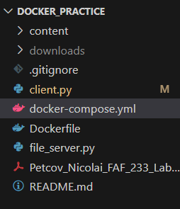
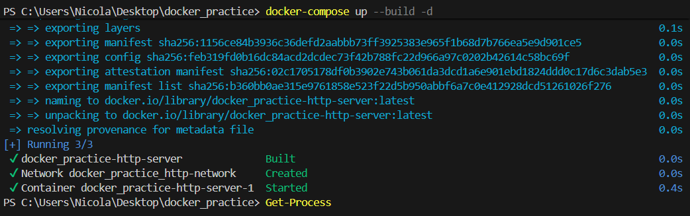

## Testing File Server Functionality

The file server was tested across different devices on the local network, demonstrating support for various file types:

### HTML Page Access
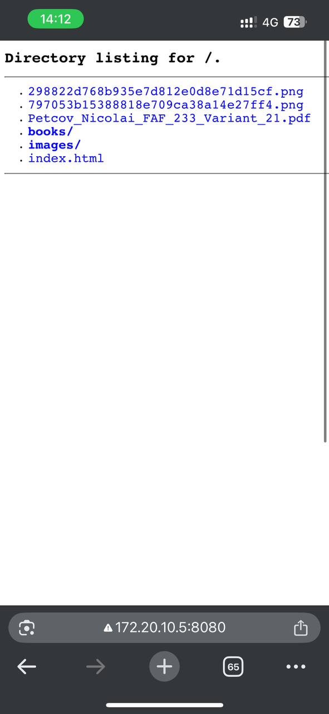

### Image File Access
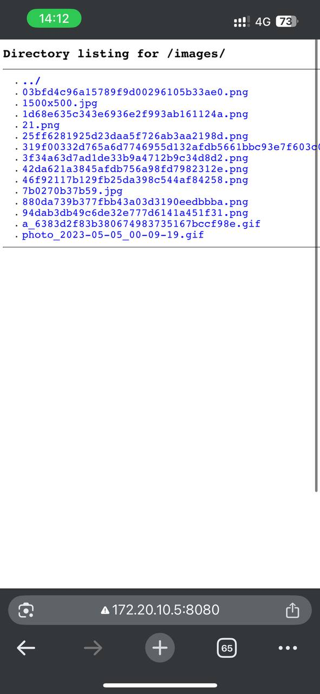

### PDF File Access
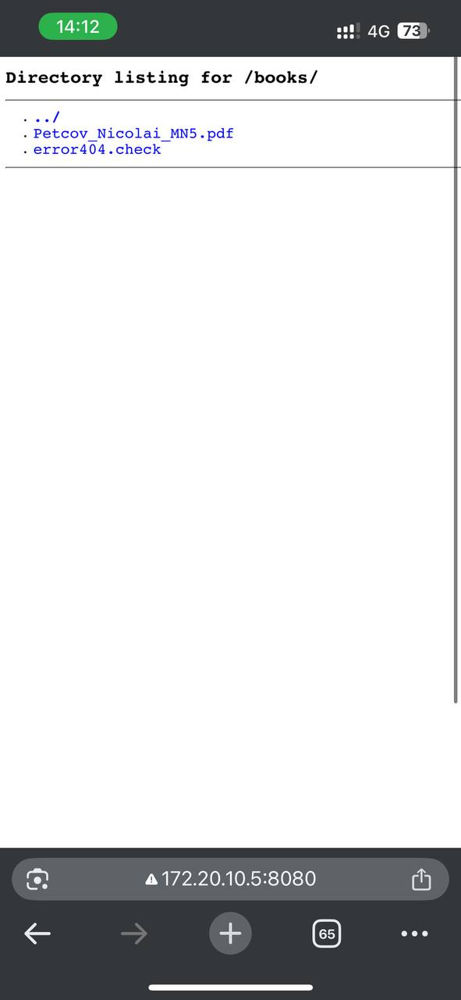
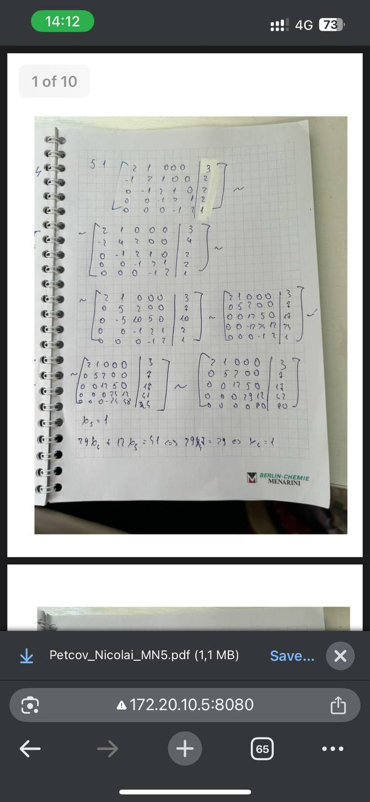

### HTML File Access
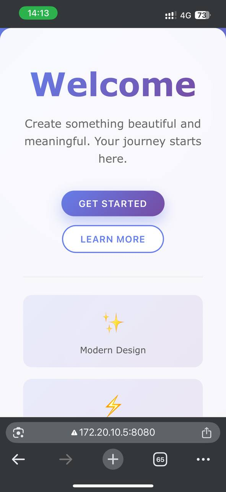

### Error Handling
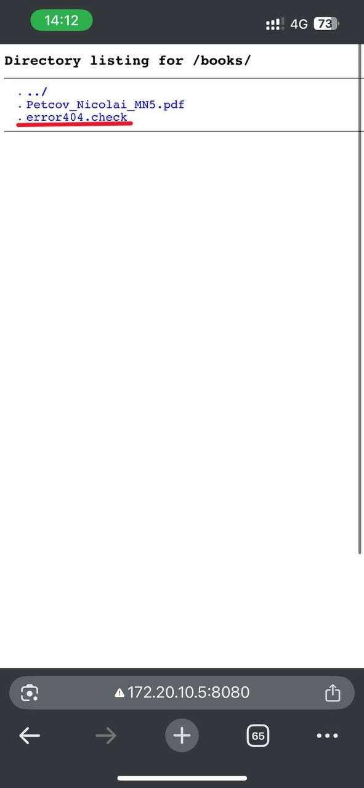
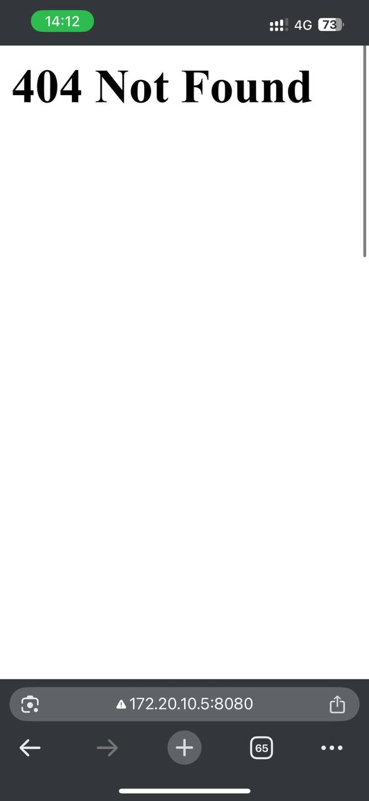

### File Download Script
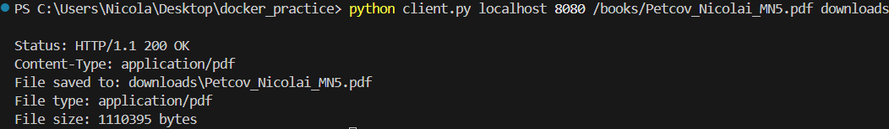
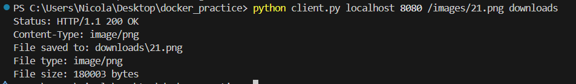
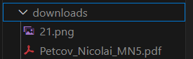


## Features

- **Pure Python Implementation:** Built using only standard libraries with TCP sockets
- **Docker Ready:** Fully containerized for easy deployment
- **Supported File Types:** HTML, PNG, PDF files
- **Directory Browsing:** Auto-generated HTML listings of directories
- **Security:** Path traversal protection and input validation
- **Custom HTTP Client:** For downloading and viewing server content

## 🚀 Quick Start

### Docker Deployment (Recommended)

```bash
# Clone the repository
git clone https://github.com/Nickseen/Docker_Practice.git
cd Docker_Practice

# Build and start the container
docker-compose up --build -d

# Access the server
# http://localhost:8080/
```

### Local Deployment

```bash
# Clone the repository
git clone https://github.com/Nickseen/Docker_Practice.git
cd Docker_Practice

# Run the server
python file_server.py content/

# Access the server
# http://localhost:8080/
```

## 📁 Project Structure

```
docker_practice/
├── file_server.py          # HTTP server implementation
├── client.py               # HTTP client for testing
├── Dockerfile              # Docker container configuration
├── docker-compose.yml      # Docker compose setup
├── content/                # Content directory to serve
│   ├── index.html          # Main HTML page
│   ├── sample-document.pdf # Sample PDF file
│   ├── books/              # Subdirectory with PDFs
│   │   ├── programming-guide.pdf
│   │   └── networking-book.pdf
│   └── images/             # Images directory
│       └── library.png     # PNG image file
```

## 🔧 Server Features

### File Serving

The server supports the following file types:

| File Type | MIME Type | Handling |
|-----------|-----------|----------|
| HTML | text/html | Served as text |
| PNG | image/png | Served as binary |
| PDF | application/pdf | Served as binary |
| Unsupported | | Returns 404 Not Found |

### Directory Listing

When a directory is requested, the server generates an HTML page with:
- Links to all files and subdirectories
- Navigation to parent directory
- Visual distinction between files and directories

### Error Handling

| Status Code | Description |
|-------------|-------------|
| 200 | OK - Resource found and delivered |
| 400 | Bad Request - Malformed request |
| 403 | Forbidden - Path traversal attempt detected |
| 404 | Not Found - Resource doesn't exist or unsupported file type |
| 405 | Method Not Allowed - Only GET is supported |
| 500 | Internal Server Error - Server processing error |

## 🖥️ Usage Instructions

### Running the Server

```bash
# Using Python directly
python file_server.py content/

# Using Docker
docker-compose up --build -d
```

The server will listen on port 8080 by default.

### HTTP Client Usage

The included HTTP client allows for simple file downloads:

```bash
# Syntax
python client.py <host> <port> <resource> <save_directory>

# Examples
python client.py localhost 8080 /index.html downloads/
python client.py localhost 8080 /images/library.png downloads/
python client.py localhost 8080 /books/sample-document.pdf downloads/
```

### Testing Specific Features

| Test Case | URL | Expected Result |
|-----------|-----|-----------------|
| HTML Page | http://localhost:8080/index.html | Displays HTML content |
| PNG Image | http://localhost:8080/images/library.png | Displays/downloads image |
| PDF Document | http://localhost:8080/books/sample-document.pdf | Opens/downloads PDF |
| Directory Listing | http://localhost:8080/books/ | Shows directory contents |
| Unsupported Format | http://localhost:8080/scripts/app.js | Returns 404 error |

## 🌐 Network Sharing

To share your server with friends on a local network:

1. Find your local IP address:
   ```powershell
   ipconfig
   ```

2. Share the URL with your friends:
   ```
   http://YOUR_IP:8080/
   ```

3. Friends can use the client to download files:
   ```bash
   python client.py YOUR_IP 8080 /index.html downloads/
   ```

## 📋 Implementation Requirements

| Requirement | Status |
|-------------|--------|
| HTTP File Server | ✅ Implemented with Python sockets |
| Specific File Type Support | ✅ HTML, PNG, PDF only |
| Error Handling | ✅ Returns 404 for unsupported types |
| Directory Listing | ✅ Generated HTML for navigation |
| Docker Support | ✅ Containerized with docker-compose |
| Network Sharing | ✅ Configurable for LAN access |
| HTTP Client | ✅ Command-line client included |
| Security | ✅ Path traversal protection |